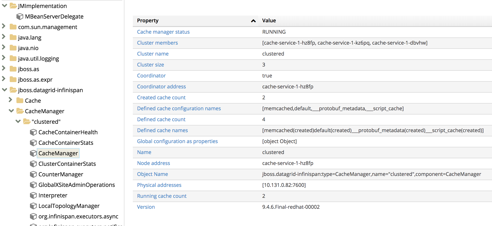

[![OpenShift Version][openshift-heximage]][openshift-url]

# EAP External HTTP sessions
Example of externalizing HTTP sessions from [JBoss EAP][11] (aka Wildfly) into a clustered [Data Grid][7] - on OpenShift

## Why sessions?
Basically, because you need a place to store data specific to a user using your webapp. It's likely you either know or have heard folks says "[HTTP is stateless][1]". But users interacting with your webapp expect an experience where the app remembers things about them and what they're doing (a typical example of this is a shopping cart). Stateless HTTP and keeping info about the user are opposing things. And so sessions are used a way to keep user state.

## Why external?
This allows scaling of the sessions independent of the application. And by having the data layer reside external to JBoss EAP, different JBoss EAP instances can access shared data. So this independence is a nice architectural design that protects your session data in the case of server containers crashing or recreating/patching an application server. It also has the advantage of keeping individual JBoss EAP instances lighter and free of heap usage.

## What is Data Grid?
Data Grid is is an extremely scalable, highly available key/value data store. We are using it here to externalize the user sessions. It is often used as a distributed cache, but also can serve as a NoSQL key/value store or object database. You can learn more [about Data Grid here][7].

## Setup & demo steps
You will need an OpenShift cluster to run this demo. If you don't have a cluster, [try using the CDK][8] for 3.x versions of OpenShift. And soon [CodeReady Containers][9] will be available for 4.x versions of OpenShift.

Everything will reside in the same project. So let's create that first:
```oc new-project eap-dg-demo```

### Install data grid
Run the following commands to setup Data Grid (uses templates, in the future there will be an Operator to do the install)

```
oc new-app --template=datagrid73-basic \
  -p CACHE_NAMES=default,testing \
  -p MEMCACHED_CACHE=memcached \
  -p APPLICATION_NAME=cache-service

oc scale --replicas=3 dc cache-service
```

<!-- new templates use TLS ```
oc new-app cache-service \
  -p APPLICATION_USER=developer \
  -p APPLICATION_PASSWORD=password \
  -p NUMBER_OF_INSTANCES=3 \
  -p REPLICATION_FACTOR=2
```

Also, expose a REST route - just for some demo/testing:
```oc create route reencrypt cache-rest --port=https --service=cache-service```
-->

:information_source: Data Grid is part of the OpenShift Runtimes bundle. If you own Runtimes but don't see Data Grid templates in your OpenShift cluster [you need to follow steps here][12]

### Build & deploy the app in EAP on OpenShift
<!-- If we switch to TLS Hotrod protocol
First we need to pull the TLS certs from Data Grid to allow our app communicate securely with the cache. Do the following:
```
cd /tmp
oc get secret service-certs -o jsonpath='{.data.tls\.crt}' | base64 -D > tls.crt
```
*** TBD - get the certs into EAP via configmap?
-->

Run the following command to create a bunch of OpenShift resources that will clone, build the code, build a container, deploy, and run our webapp:
```
oc new-app --template=eap71-basic-s2i \
  -p SOURCE_REPOSITORY_URL=https://github.com/dudash/eap-external-http-sessions \
  -p SOURCE_REPOSITORY_REF=master \
  -p CONTEXT_DIR= \
  -e JGROUPS_PING_PROTOCOL=openshift.DNS_PING \
  -e OPENSHIFT_DNS_PING_SERVICE_NAME=eap-app-ping \
  -e OPENSHIFT_DNS_PING_SERVICE_PORT=8888 \
  -e CACHE_NAME=default
```

Now scale the webapp to 2 replicas:
```oc scale --replicas=2 dc eap-app```

### Demo steps
If everything above worked without errors, you are good to test a few things out. 

Let's check we can put/get data into the cache. Put something in with:
```
curl -X PUT -u developer:password \
  -H 'Content-type: text/plain' \
  -d 'world' \
  https://{YOUR-CACHE-ROUTE}/rest/testing/hello
```

Pull that back out with:
```
curl -i -u developer:password \
  -H 'Content-type: text/plain' \
  https://{YOUR-CACHE-ROUTE}/rest/testing/hello
```

...

Now, let's check the JMX console and make sure EAP is clustered and using Data Grid:

In the OpenShift console, click Applications->Pods, and choose one of the Data Grid pods (it'll look like `cache-service-1-hz8fp`). On the right side in the Containers section you should have a link for "Open Java Console". Click to open that up.

If you expand the clustering details you should see a cluster size of 3 just like the screenshot below:


And let's access the webapp and see that our session data is being maintained.

In the OpenShift console, find the route for your webapp and click it. Add `/http-session-counter/` to the end of it. Now refresh the page a few times. You'll see the counter incrementing for this session and it will sometime be served by different EAP container instances. Woot the session is external. 

Now if you want to try deleting pods or killing containers and seeing how the user session stays around, go for it.


### (Coming Soon) Extra credit - use with CodeReady Workspaces
Let's use a web IDE called CodeReady Workspaces to change the app's code, build a new container, and deploy it.

TBD - fork the app
TBD - launch Che
TBD - import your git repo
TBD - change code
TBD - build local (`mvn clean package`)
TBD - deploy to cluster

:information_source: Another way that you might set this up in your environment is git commits trigger a pipeline execution


## About the code / software architecture
The parts in action here are:
* Demo JSP webapp (thanks to `mvocale` because I based this off [his example][2])
* Middleware components for:
    * [JBoss EAP][11] (aka Wildfly) as our J2EE app server
    * [Red Hat Data Grid][7] for user sessions
    * [CodeReady Workspaces][10] (aka Eclipse Che) for web-based coding
* OpenShift/Kubernetes for:
    * Operator to deploy/manage Data Grid 
    * Automatic IP address/ports via SDN
    * Load balancing, deployment replication for scaled EAP servers
    * Load balancing, [stateful mgmt][14] for scaled Data Grid cluster
    * Router for getting HTTP traffic to our load balanced application


## More Info / References
If you want to get deeper and try other examples of using Data Grid, check out this repo with for more content:
* [https://github.com/jboss-developer/jboss-jdg-quickstarts](https://github.com/jboss-developer/jboss-jdg-quickstarts)


[1]: https://launchschool.com/books/http/read/statefulness
[2]: https://github.com/mvocale/http-session-counter-openshift
[3]: https://github.com/eformat/openshift-v3-workshop/blob/master/16.%20Web%20Session%20Replication%20and%20JBoss%20EAP%20Clustering.md
[4]: https://access.redhat.com/documentation/en-us/red_hat_jboss_enterprise_application_platform/7.2/html/configuration_guide/configuring_high_availability#jdg_externalize_http_sessions
[5]: https://developers.redhat.com/blog/2018/05/04/externalized-http-session-in-openshift-3-9/
[6]: https://redislabs.com/blog/cache-vs-session-store/
[7]: https://www.redhat.com/en/technologies/jboss-middleware/data-grid
[8]: https://developers.redhat.com/products/cdk
[9]: https://github.com/code-ready/crc
[10]: https://developers.redhat.com/products/codeready-workspaces/overview
[11]: https://www.redhat.com/en/technologies/jboss-middleware/application-platform
[12]: https://access.redhat.com/documentation/en-us/red_hat_data_grid/7.3/html/red_hat_data_grid_for_openshift/os_services#confirming_service_availability
[13]: https://github.com/jboss-developer/jboss-jdg-quickstarts
[14]: https://kubernetes.io/docs/concepts/workloads/controllers/statefulset/
[15]: https://access.redhat.com/documentation/en-us/red_hat_jboss_enterprise_application_platform/7.2/html-single/development_guide/index#session_replication

[openshift-heximage]: https://img.shields.io/badge/openshift-3.11-BB261A.svg
[openshift-url]: https://docs.openshift.com/container-platform/3.11/welcome/index.html